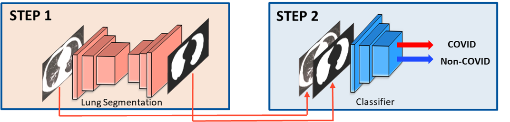
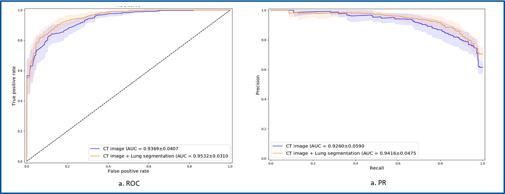
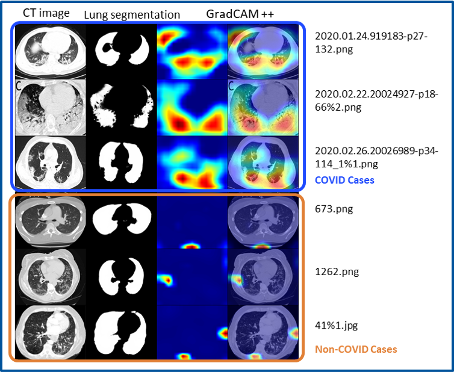

# COVID-19 Classification by Integrating Lung Segmentation on CT Images
#### : This is a code repository of the one of the **Finalists** on 2020 INFORMS QSR Industry Data Challenge, CT Scan DIagnosis for COVID-19

> **Seonho Park** (U. of Florida), **Farnaz Babaie Sarijaloo** (U. of Florida), **Bijan Taslimi** (U. of Florida)
#### Covid-19 pandemic is the most serious concern of this year, 2020. It is necessary to use effective and reliable methods to diagnose COVID-19. Molecular testing by nasal swab testing is one of the testing methods to disgnose COVID-19 but it still has a false negative issue. Computed tomography (CT) scans can be an auxiliary manner for screening and diagnosing COVID-19. This is a convolutional neural network based COVID-19 CT scan classification by integrating lung segmentation to augment the COVID-19 CT image data


## Requirements
* pytorch == 1.5.0

## Methodology

<div align="center">
  
</div>

### STEP 1: Lung segmentation
- ResUNet18 based lung segmentation
- Data: please download and place 2d_images.zip and 2d_masks.zip for the lung segmentation data from the [link](https://www.kaggle.com/kmader/finding-lungs-in-ct-data).
- Execution
```bash
python lungseg.py --datapath <datapath>
```

### STEP 2: Classification
- MobileNetv2 is used as a backbone for the classification
- the input of the model is a grayscaled CT image as well as the lung segmentation output from the step 1
- Data: please download and place the following data from the [link](https://github.com/UCSD-AI4H/COVID-CT)
- Execution
```bash
python train.py --datapath <datapath>
```

## Results
### Performance (AUROC & AUPR)

<div align="center">
  
</div>

### GradCAM++ Result

<div align="center">
  
</div>